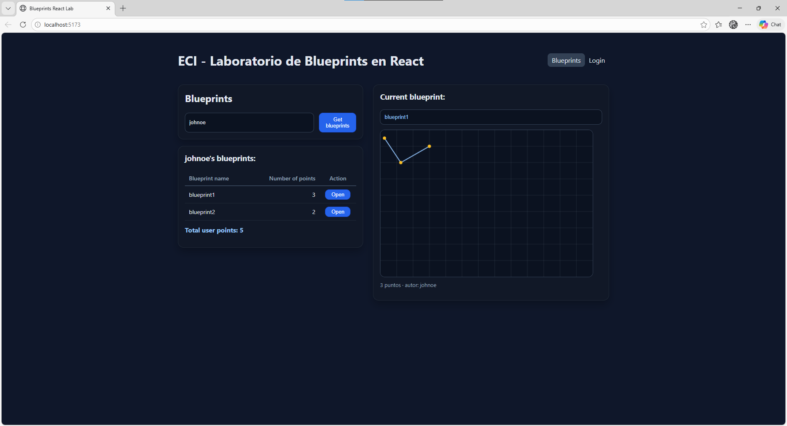

# Lab – React Client for Blueprints (Redux + Axios + JWT)

## Yojhan Toro Rivera - Ivan Cubillos Vela

> Basado en el cliente HTML/JS del repo de referencia, este laboratorio moderniza el _frontend_ con **React + Vite**, **Redux Toolkit**, **Axios** (con interceptores y JWT), **React Router** y pruebas con **Vitest + Testing Library**.

## Objetivos de aprendizaje

- Diseñar una SPA en React aplicando **componetización** y **Redux (reducers/slices)**.
- Consumir APIs REST de Blueprints con **Axios** y manejar **estados de carga/errores**.
- Integrar **autenticación JWT** con interceptores y rutas protegidas.
- Aplicar buenas prácticas: estructura de carpetas, `.env`, linters, testing, CI.

## Requisitos previos

- Tener corriendo el backend de Blueprints de los **Labs 3 y 4** (APIs + seguridad).
- Node.js 18+ y npm.

Ver la especificación de glosario clave, consulta las [Definiciones del laboratorio](./DEFINICIONES.md).

## Endpoints esperados (ajústalos si tu backend quedo diferente)

- `GET /api/blueprints` → lista general o catálogo para derivar autores.
- `GET /api/blueprints/{author}`
- `GET /api/blueprints/{author}/{name}`
- `POST /api/blueprints` (requiere JWT)
- `POST /api/auth/login` → `{ token }`

Configura la URL base en `.env`.

## Cómo arrancar

```bash
npm install
cp .env.example .env
# edita .env con la URL del backend
npm run dev
```

Abre `http://localhost:5173`

## Variables de entorno

Crea un archivo `.env` en la raíz:

```variable
VITE_API_BASE_URL=http://localhost:8080/api
```

> **Tip:** en producción usa variables seguras o un _reverse proxy_.

## Estructura

```carpetas
blueprints-react-lab/
├─ src/
│  ├─ components/
│  ├─ features/blueprints/blueprintsSlice.js
│  ├─ pages/
│  ├─ services/apiClient.js   # axios + interceptores JWT
│  ├─ store/index.js          # Redux Toolkit
│  ├─ App.jsx, main.jsx, styles.css
├─ tests/
├─ .github/workflows/ci.yml
├─ index.html, package.json, vite.config.js, README.md
```

## 📌 Requerimientos del laboratorio

## 1. Canvas (lienzo)

- Agregar un lienzo (Canvas) a la página.
- Incluir un componente `BlueprintCanvas` con un identificador propio.
- Definir dimensiones adecuadas (ej. `520×360`) para que no ocupe toda la pantalla pero permita dibujar los planos

Se agregó data-testid="blueprint-canvas" al "canvas" en BlueprintCanvas.jsx para poder identificarlo fácil en las pruebas, también se dejaron dimensiones fijas de 520×360, así se puede dibujar bien sin que el canvas ocupe toda la pantalla

## 2. Listar los planos de un autor

- Permitir ingresar el nombre de un autor y consultar sus planos desde el backend (o mock).
- Mostrar los resultados en una tabla con las siguientes columnas:
  - Nombre del plano
  - Número de puntos
  - Botón `Open` para abrirlo

BlueprintList.jsx se cambió de tarjetas a una tabla con las tres columnas que pedían, Blueprint name, Number of points y el botón Open, en BlueprintsPage.jsx cuando se escribe el autor en el input se ejecuta fetchByAuthor y los resultados se guardan en Redux

## 3. Seleccionar un plano y graficarlo

Al hacer clic en el botón `Open`, debe:

- Actualizar un campo de texto con el nombre del plano actual.
- Obtener los puntos del plano correspondiente.
- Dibujar consecutivamente los segmentos de recta en el canvas y marcar cada punto.

Se modifico de tal manera que cuando se hace clic en Open se despacha fetchBlueprint, eso actualiza current en Redux, con eso se actualiza el "input readOnly" con el nombre del plano y también se mandan los puntos a BlueprintCanvas, donde se dibujan las líneas entre puntos consecutivos y cada punto se marca con un círculo amarillo

## 4. Servicios: `apimock` y `apiclient`

- Implementar dos servicios con la misma interfaz:
  - `apimock`: retorna datos de prueba desde memoria.
  - `apiclient`: consume el API REST real con Axios.
- La interfaz de ambos debe incluir los métodos:
  - `getAll`
  - `getByAuthor`
  - `getByAuthorAndName`
  - `create`
- Habilitar el cambio entre `apimock` y `apiclient` con una sola línea de código:
  - Definir un módulo `blueprintsService.js` que importe uno u otro según una variable en `.env`.
  - Ejemplo en `.env` (Vite):

```env
VITE_USE_MOCK=true
```

- `VITE_USE_MOCK=true` usa el mock.
- `VITE_USE_MOCK=false` usa el API real.

## 5. Interfaz con React

- El nombre del plano actual debe mostrarse en el DOM como parte del estado global (Redux).
- Evitar manipular directamente el DOM; usar componentes y props/estado.

Ahora el nombre del plano actual se toma de state.blueprints.current.name usando useSelector y se muestra en el "input readOnly", en ningún momento se usa document.getElementById ni ninguna manipulación directa del DOM, todo se maneja con estado de Redux y props entre componentes



## 6. Estilos

- Agregar estilos para mejorar la presentación.
- Se puede usar Bootstrap u otro framework CSS.
- Ajustar la tabla, botones y tarjetas para acercarse al mock de referencia.

## 7. Pruebas unitarias

- Agregar pruebas con Vitest + Testing Library para validar:
  - Render del canvas.
  - Envío de formularios.
  - Interacciones básicas con Redux (por ejemplo: dispatch de `fetchByAuthor`).

---

### Notas rápidas y recomendaciones

- Para el canvas en tests con jsdom: agregar un mock de `HTMLCanvasElement.prototype.getContext` en `tests/setup.js`.
- Para usar `@testing-library/jest-dom` con Vitest: en `tests/setup.js` importar `import '@testing-library/jest-dom'` y asegurarse de que Vitest provea el global `expect` (configurar `vitest.config.js` con la opción `test: { globals: true, setupFiles: './tests/setup.js' }`).
- Para la conmutación de servicios en Vite, usar `import.meta.env.VITE_USE_MOCK` para leer la variable en tiempo de ejecución.

## 📌 Recomendaciones y actividades sugeridas para el exito del laboratorio

1. **Redux avanzado**
   - [ ] Agrega estados `loading/error` por _thunk_ y muéstralos en la UI.
   - [ ] Implementa _memo selectors_ para derivar el top-5 de blueprints por cantidad de puntos.
2. **Rutas protegidas**
   - [ ] Crea un componente `<PrivateRoute>` y protege la creación/edición.
3. **CRUD completo**
   - [ ] Implementa `PUT /api/blueprints/{author}/{name}` y `DELETE ...` en el slice y en la UI.
   - [ ] Optimistic updates (revertir si falla).
4. **Dibujo interactivo**
   - [ ] Reemplaza el `svg` por un lienzo donde el usuario haga _click_ para agregar puntos.
   - [ ] Botón “Guardar” que envíe el blueprint.
5. **Errores y _Retry_**
   - [ ] Si `GET` falla, muestra un banner y un botón **Reintentar** que dispare el thunk.
6. **Testing**
   - [ ] Pruebas de `blueprintsSlice` (reducers puros).
   - [ ] Pruebas de componentes con Testing Library (render, interacción).
7. **CI/Lint/Format**
   - [ ] Activa **GitHub Actions** (workflow incluido) → lint + test + build.
8. **Docker (opcional)**
   - [ ] Crea `Dockerfile` (+ `compose`) para front + backend.

## Criterios de evaluación

- Funcionalidad y cobertura de casos (30%)
- Calidad de código y arquitectura (Redux, componentes, servicios) (25%)
- Manejo de estado, errores, UX (15%)
- Pruebas automatizadas (15%)
- Seguridad (JWT/Interceptores/Rutas protegidas) (10%)
- CI/Lint/Format (5%)

## Scripts

- `npm run dev` – servidor de desarrollo Vite
- `npm run build` – build de producción
- `npm run preview` – previsualizar build
- `npm run lint` – ESLint
- `npm run format` – Prettier
- `npm test` – Vitest

---

### Extensiones propuestas del reto

- **Redux Toolkit Query** para _caching_ de requests.
- **MSW** para _mocks_ sin backend.
- **Dark mode** y diseño responsive.

> Este proyecto es un punto de partida para que tus estudiantes evolucionen el cliente clásico de Blueprints a una SPA moderna con prácticas de la industria.
